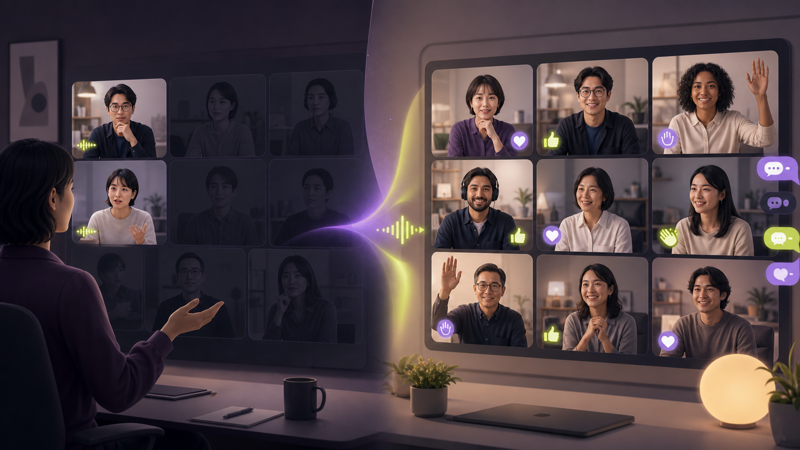
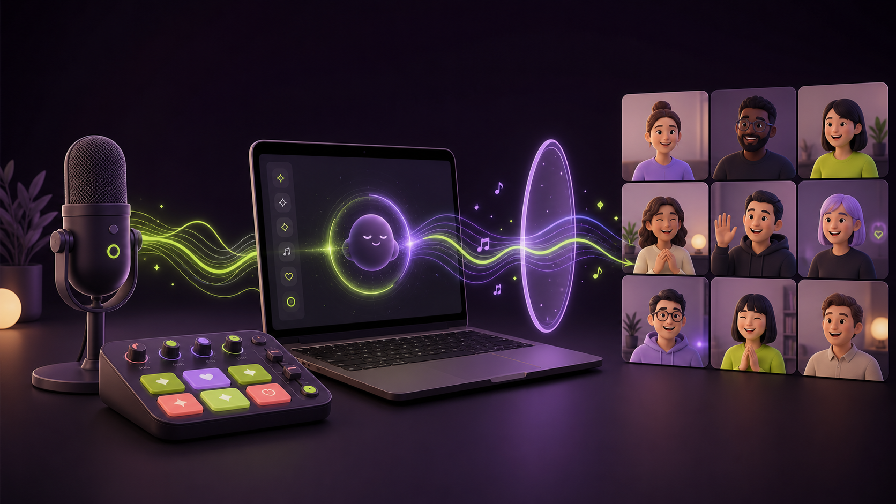

# MoodX

<p align="center">
  
</p>
<p align="center"><sub>AI-generated concept illustration: MoodX is testing this participation shift, not claiming it as a measured outcome.</sub></p>

MoodX is exploring a psychologically safe participation layer for online
meetings. The current hypothesis is that widening the ways people can
contribute—without scoring or exposing individuals—can help teams surface more
of their distributed knowledge. Its governing product principle is **fun is
the doorway to participation**: playful energy creates the opening, while
broader and safer contribution creates the enterprise value.

> **MoodX provides a doorway to participation, and value follows.**

The focused research thesis is **Fun is a doorway to participation, and value
follows**. Fun marks the opening; structured, voluntary contribution passes
through it; value exists only when that input improves understanding,
alignment, a decision, or a follow-up. See the
[dedicated research note](docs/research/2026-07-19-fun-doorway-participation-value.md).

## Project records

- [Working contract](AGENTS.md#moodx-working-contract)
- [Documentation index](docs/README.md)
- [Architecture Decision Record](docs/ADR.md)
- [Meeting memo](docs/MEETING_MEMO.md)
- [Product roadmap](docs/ROADMAP.md)
- [Central pitch deck](docs/pitch-deck/index.html)
- [Research records](docs/research/)
- [Product problem definition](docs/product/PROBLEM_DEFINITION.md)
- [Customer journey](docs/product/CUSTOMER_JOURNEY.md)
- [Technical documentation](docs/technical/README.md)
- [macOS beta distribution guide](docs/technical/BETA_DISTRIBUTION.md)

## Documentation rule

Documentation ships with the work. Every session must update the meeting memo,
and every change must review whether the ADR, pitch deck, README, and relevant
technical documentation also need to change.

## Current status

The initial problem, users, product opportunity, guardrails, and MVP hypothesis
are documented. They remain unvalidated. Research now recommends testing a
**Quiet Think** ritual at a decision or risk checkpoint in recurring Teams
meetings: a restrained cue, 45 seconds of silent thought, one explicit prompt,
an existing Teams response channel, and facilitator acknowledgment of what the
input changed. The target meeting, buyer, and proposed feasibility thresholds
remain hypotheses until interviews and a real pilot validate them. The
local-only privacy boundary and native
architecture are documented, and a Teams-based meeting energy console is
implemented as a macOS-first mixer using BlackHole for virtual-audio routing.
Research supports testing facilitator-controlled adaptive music as a future
hypothesis, but conversation capture, signal analysis, and music adaptation are
not implemented or accepted architecture. A reproducible local speech-to-text
smoke test passed the provisional compute and memory gates on synthetic English
and Japanese speech, while exposing poor automatic handling of a bilingual
window. The native prototype lets the facilitator explicitly choose
English or Japanese and run five-second local transcription from a separate
selected input. Physical-microphone capture, local runtime packaging, and
ephemeral transcript display are implemented; real Teams accuracy, remote
participant capture, concurrent long-session performance, crash cleanup, and
privacy validation remain unverified.

Version 0.3.1 unifies mixer and optional-listener startup behind one session
control and adds a persisted Light/Dark theme. The listener can be excluded
from a session without restoring a second lifecycle button.

Version 0.4.0 adds the first complete meeting-rhythm slice: one configurable
meeting timer, one protected decision checkpoint, and one facilitator-approved
45-second Quiet Think suggestion. The mechanism is implemented and locally
verified; participation and outcome value remain pilot hypotheses. See the
[centralized roadmap](docs/ROADMAP.md).

Run the benchmark after separately building whisper.cpp and downloading the
multilingual model and optional VAD model:

```zsh
python3 scripts/benchmark_local_stt.py \
  --whisper-bin /path/to/whisper-cli \
  --model /path/to/ggml-small.bin \
  --vad-model /path/to/ggml-silero-v6.2.0.bin
```

The harness makes no network requests. It stores generated fixtures and
transcripts under the ignored `.cache/` directory by default.

## Native macOS mixer

<p align="center">
  
</p>
<p align="center"><sub>AI-generated system concept. The authoritative implemented architecture is documented under <code>docs/technical/</code>.</sub></p>

The canonical product lives in [`macos/MoodXMixer/`](macos/MoodXMixer/). It is a
native SwiftUI application that captures a physical microphone, mixes in
built-in or user-selected local sound effects, and sends the combined signal to
BlackHole for use as the Teams microphone. Each pad can remember its own local
audio file across launches.

Build the local app bundle:

```zsh
zsh scripts/build_macos_app.sh
open "dist/MoodX Mixer.app"
```

See the [native mixer setup guide](macos/MoodXMixer/README.md) for BlackHole and
Teams routing. The earlier [`mixer/`](mixer/) browser implementation remains as
an interaction prototype and fallback, not the canonical runtime.

The [living HTML pitch deck](docs/pitch-deck/index.html) now includes the
current demo flow, a precise local-audio system overview, build evidence,
guardrails, and documented AI-generated concept illustrations.

See [What MoodX should do next](docs/research/2026-07-19-what-next-product-research.md)
for the evidence, competitive implications, initial customer hypothesis,
experiment design, feasibility gates, falsification criteria, and recommended
roadmap.

## Project agents

MoodX has two project-scoped Codex agents under `.codex/agents/`:

- `researcher` produces bounded, evidence-first research briefs and does not
  modify the repository.
- `image_generator` creates documented visual assets under `assets/generated/`
  using the Gemini API.

Ask Codex to use either agent by name. Agent activity is available in supported
Codex IDE, app, and CLI surfaces.

## Image generation

Copy `.env.example` conventions into the local `.env`. The generator accepts
the preferred `GEMINI_API_KEY` variable and the existing `GEMINI_API` alias.
Secrets must never be committed or printed.

Validate a request without calling the API:

```bash
python3 scripts/generate_image.py \
  --prompt "A complete visual brief" \
  --output assets/generated/example.jpg \
  --aspect-ratio 16:9 \
  --dry-run
```

Remove `--dry-run` to generate the asset. Each image receives a JSON metadata
sidecar recording the exact generation request and SHA-256 digest. Public use
also requires a visible AI disclosure and human review.
