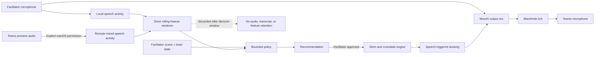

# Adaptive Music for Online Meetings

- **Research date:** 2026-07-19
- **Status:** Evidence review and experiment recommendation; not an accepted
  architecture or implementation commitment
- **Question:** Should MoodX use AI or machine learning to adapt background
  music to a live Microsoft Teams conversation?
- **Scope:** Behavioral evidence, closely related prototypes, comparable
  products, macOS feasibility, Teams transport, privacy, and a validation plan
- **Method:** Review of peer-reviewed papers and author manuscripts, official
  Apple and Microsoft documentation, official government guidance, and vendor
  documentation. No customer interviews or MoodX user study were performed.
- **Legal note:** This document is product research, not legal advice.

## Executive conclusion

The idea is credible enough to test, but the evidence does not justify building
an autonomous conversation-scoring or generative-music system.

Two small studies are unusually close to MoodX. A three-person pilot varied
background-music tempo according to speaking amount and observed more balanced
talk shares. A later 14-person prototype generated music from live interview
transcripts and received moderately positive subjective ratings for relaxation
and concentration. Neither study establishes that adaptive music improves
engagement in enterprise group meetings: the first had only three participants,
and the second used one-on-one casual interviews, had no silence/control
condition, processed only the interviewee, and adapted to conversation from
minutes earlier.

Broader evidence is mixed. Instrumental music may be tolerable and can support
some creative-group conditions, but lyrics predictably compete with verbal
tasks, and instrumental music has not shown a dependable general cognitive
benefit over silence. Individual preference, task type, volume, tempo, and
familiarity materially affect results.

The recommended MoodX experiment is therefore:

> **A facilitator-controlled adaptive scene engine using licensed instrumental
> stems, silence as a first-class scene, speech-triggered ducking, and no
> transcription, emotion inference, speaker identification, or generative
> music.**

AI/ML should enter only if a simpler rules-based prototype demonstrates that
music is useful and that an on-device model measurably improves recommendations.

## What the evidence says

### 1. Meeting-specific evidence is promising but preliminary

| Evidence | Result | What it supports | Important limitation |
|---|---|---|---|
| [DiscussionJockey pilot (Suzawa et al., 2022)](https://imlab.jp/publication_data/1925/3544793.3560384.pdf) | In one three-person, 10-minute creativity task, talk shares moved from 48.7% / 27.9% / 23.4% without music to 38.6% / 31.9% / 29.5% with dynamically assigned tempos. | Music can function as implicit conversational feedback and speaking amount is a plausible control signal. | Three volunteers, one task, no inferential statistics, uncertain direction of causality, and each participant received a tempo based on individual rank. MoodX currently sends one shared mix to everyone. |
| [Discussion Jockey 2 (Suzawa et al., 2025 preprint)](https://www.dfki.de/fileadmin/user_upload/import/15766__AHs_Demo__MusicGen_Meeting.pdf) | Fourteen people completed 20-minute one-on-one interviews. Average self-ratings were 5.75/9 for relaxation, 5.86/9 for concentration, and 5.67/9 for liking. | Context-aware meeting music is technically possible and acceptable to at least some participants. Personal preference and transition timing matter. | No silence or non-adaptive control; causal improvement was not tested. Only the interviewee's voice was processed. The cloud pipeline transcribed three-minute chunks, generated a description, created a 10-second loop, and reacted about two chunks late. Only four of 13 scenario responses favored meeting use. |
| [Background music and group creativity (Hosseini et al., 2019)](https://www.frontiersin.org/journals/psychology/articles/10.3389/fpsyg.2019.02577/full) | In a repeated-measures study of 20 dyads, music condition affected creativity measures; positive/upbeat music was associated with greater fluency, originality, and idea integration in the tested task. | A bounded brainstorming mode is more plausible than continuous music across every meeting type. | Laboratory creative task, small sample, cross-cultural and familiarity limitations, and no online enterprise-meeting context. It does not validate automatic adaptation. |
| [Music with and without lyrics during cognitive tasks (Souza & Barbosa, 2023)](https://pmc.ncbi.nlm.nih.gov/articles/PMC10162369/) | Across four tasks with roughly 113–123 participants, music with lyrics impaired verbal memory, visual memory, and reading comprehension by small amounts. Instrumental lo-fi produced no credible general benefit over silence. | Use instrumental material, keep silence available, and test speech comprehension rather than assuming music improves focus. | Individual laboratory tasks rather than conversation; one instrumental style cannot represent all music. |

The evidence supports a **narrow experiment**, not the claim that music makes
meetings more engaging. No reviewed study demonstrates improved contribution
breadth, decision quality, psychological safety, or enterprise meeting outcomes
from context-aware music.

### 2. The closest commercial pattern is adaptive soundscape generation

[Endel](https://endel.io/technology) demonstrates a relevant interaction and
engineering pattern: contextual inputs drive an on-device engine made from
sound layers, modulation, and effects. Its documented signals include time,
light, weather, motion, and heart rate. This validates layered, parameterized
soundscapes as a product pattern, not the efficacy of conversation-aware music.

[Mubert's API](https://mubert.com/api/docs) demonstrates API-delivered AI music,
but its network and streaming endpoints conflict with MoodX's current offline,
no-upload boundary. Neither product is direct evidence for enterprise meeting
engagement, and the review found no established commercial product offering
MoodX's exact combination of local Teams mixing and conversation-responsive
shared music.

## Feasibility in the current MoodX system

### The present app cannot observe the whole conversation

The current native graph receives the facilitator's physical microphone and
MoodX pad audio, then sends the mix through BlackHole to Teams. Remote
participants arrive through the Teams speaker path, outside MoodX. A model
connected to the existing input would therefore react mostly to the
facilitator—not to the meeting.

Apple documents two consent-gated paths for a future technical spike:

- [Core Audio process taps](https://developer.apple.com/documentation/coreaudio/capturing-system-audio-with-core-audio-taps)
  can capture outgoing audio from one process or a group of processes and use
  the tap as an aggregate-device input. Apple requires macOS 14.2 or later,
  `NSAudioCaptureUsageDescription`, and system audio recording permission.
- [ScreenCaptureKit](https://developer.apple.com/documentation/screencapturekit)
  can capture selected applications' audio with system selection and privacy
  safeguards, but its screen-capture permission framing may be less clear for
  an audio-only product.

A Teams-only Core Audio process tap is the more coherent spike for the current
Core Audio aggregate architecture. It would still be a material architecture
and privacy change requiring a new ADR before implementation.

### Candidate flow, not current architecture

This design can detect meeting-level states such as sustained silence, local
speech, remote mixed speech, and simultaneous local/remote activity. It cannot
reliably measure which remote participant is speaking or whether contribution
is equitable because Teams output is one mixed stream. Speaker-level analysis
would require diarization, participant media streams, or a Teams integration,
all of which expand privacy and platform scope.

### ML is not necessary for the first useful version

The existing `AVAudioEngine` can play buffers, mix nodes, and apply audio
effects. A first scene engine can therefore be deterministic:

1. facilitator chooses **Arrival**, **Brainstorm**, **Quiet Think**, **Reflect**,
   **Celebrate**, or **Silence**;
2. the engine layers licensed stems and crossfades between intensity levels;
3. voice activity immediately ducks or pauses music so speech stays primary;
4. sustained silence may produce a visible recommendation, never surprise
   playback;
5. facilitator approval changes the scene.

If rules prove inadequate, Apple's
[Sound Analysis](https://developer.apple.com/documentation/soundanalysis/)
can classify live audio streams with a built-in or custom Core ML model, and
[Create ML](https://developer.apple.com/documentation/createml/mlsoundclassifier)
can train a device-side sound classifier. A model should be adopted only after
it beats the deterministic baseline on a declared test set and its output can
be explained as a limited meeting event—not as an emotional judgment.

Ephemeral local speech-to-text is also technically feasible on the development
M4 Max if a later experiment needs explicit meeting-intent recognition. It does
not replace the need for a separate Teams playback capture path and should come
only after the manual and rules baselines. See
[`2026-07-19-local-stt-feasibility.md`](2026-07-19-local-stt-feasibility.md).

## Teams transport risk

Teams is optimized for speech and may suppress music. Microsoft documents that
high noise suppression removes non-speech sounds, while low suppression is the
setting intended when playing music. Teams also offers
[high-fidelity music mode](https://support.microsoft.com/en-us/teams/notifications-settings/use-high-fidelity-music-mode-to-play-music-in-microsoft-teams),
but Microsoft says it is best for music content rather than normal speech. It
uses 32 kHz at up to 128 kbps when bandwidth allows and may fall to 48 kbps.

MoodX combines speech and music in one virtual microphone, so neither setting
can be assumed correct. Before adaptive logic, a remote-listener test must
compare:

- ordinary Teams audio with automatic/background-noise suppression;
- low or disabled suppression;
- high-fidelity music mode;
- speech-only, music-only, and mixed speech/music at several levels;
- headphones versus speaker playback; and
- good versus constrained network conditions.

Required observations are speech intelligibility, listening effort, music
audibility, pumping/suppression artifacts, clipping, echo, and facilitator
setup burden. Microsoft also states that the user is responsible for securing
the rights needed for music shared through Teams.

## Privacy and responsible-use boundary

On-device processing reduces exposure but does not make covert analysis
acceptable. Capturing Teams process audio is still processing coworkers'
conversation and triggers a macOS permission prompt.

The [Japan AI Guidelines for Business 1.2](https://www.meti.go.jp/shingikai/mono_info_service/ai_shakai_jisso/pdf/20260331_12.pdf)
recommend a human-centric, risk-based approach; privacy protection across the
AI lifecycle; transparency about AI use; architecture and data-processing
documentation; and human intervention. The guidelines are non-binding soft
law, and relevant privacy and employment obligations still need counsel review.

The [EU AI Act overview](https://digital-strategy.ec.europa.eu/en/policies/regulatory-framework-ai)
states that workplace emotion recognition is a prohibited practice, with the
prohibition applicable since February 2025. MoodX should keep emotion inference
outside the product globally rather than maintain a risky regional variant.

Minimum safeguards for any spike are:

- explicit organizer and participant notice before analysis starts;
- visible **Conversation sensing on** state and one-action stop;
- Teams-process-only capture, excluding MoodX and other system audio;
- ephemeral features with no raw audio, transcript, embedding, or feature-log
  retention;
- no speaker identity, emotion, sentiment, personality, or individual score;
- recommendations expressed as observable events, such as “18 seconds of
  silence,” not judgments such as “the room is bored”;
- a participant-accessible music-off condition and silence scene;
- local inference with no network dependency for the initial experiment; and
- documented model, dataset, thresholds, false-trigger tests, and limitations
  if ML is later introduced.

## Recommended product experiment

### Phase 0 — transport and listening safety

Complete the Teams remote-listener matrix above. Do not proceed if mixed speech
and music cannot remain intelligible without fragile per-meeting setup.

### Phase 1 — manual scenes, no conversation capture

Add two or three instrumental stem sets, smooth crossfades, speech ducking,
scene buttons, **Silence**, and panic stop. Test only bounded moments: arrival,
quiet brainstorming, transitions, breaks, and celebration. Avoid continuous
music during decision-heavy or information-dense discussion.

### Phase 2 — Wizard-of-Oz recommendations

Show recommendations at predefined timer points or trigger them manually behind
the scenes. This tests whether recommendations help facilitators without asking
MoodX to capture the meeting.

### Phase 3 — consented local signal prototype

Only if phases 1 and 2 succeed, add a Teams process-audio tap and derive
meeting-level speech activity in short memory-only windows. Compare a declared
rules baseline with any small on-device model. Keep approval manual.

### Study design

Use a within-team, counterbalanced comparison across:

1. silence/control;
2. facilitator-controlled manual scenes; and
3. facilitator-approved adaptive recommendations using the same music assets.

The first study should select one meeting type, preferably a bounded creative
brainstorm rather than status reporting. Sample size and success thresholds are
`TBD` pending a pilot and power analysis. Measure:

- speech intelligibility and perceived listening effort;
- distraction, comfort, relaxation, and concentration;
- participant music preference and desire for silence;
- facilitator workload and number of rejected recommendations;
- number of people who contribute, observed at team level with explicit study
  consent rather than inferred by the product;
- idea count, decision clarity, and meeting duration where relevant; and
- technical failures, false triggers, echo, clipping, and suppression artifacts.

Predefine stop conditions: any participant requests silence; speech becomes
harder to understand; music produces repeated suppression artifacts; the
facilitator cannot recover instantly; or the adaptive condition increases
distraction without a compensating outcome.

## Product recommendation

Proceed with a **small manual-scene prototype and Teams transport test**. Do not
yet implement transcript-driven generation, emotion detection, per-person talk
ranking, or autonomous music changes.

If the manual experience fails, ML will not rescue the proposition. If it
succeeds, the next defensible innovation is not a large generative model; it is
a privacy-preserving, meeting-level policy that chooses among known-good stems
and explains every recommendation.

## Open decisions

- First meeting type and participant profile: `TBD`.
- Initial stem provider, license, and enterprise performance rights: `TBD`.
- Target music-to-speech level, ducking depth, attack, and release: `TBD` after
  Teams testing.
- Core Audio process tap versus ScreenCaptureKit for a future spike: proposed
  preference is Core Audio tap, not accepted.
- Whether any ML model is needed after rules-based validation: `TBD`.
- Consent owner, notice wording, study recording policy, and legal review:
  `TBD`.

## Source list

### Research

- [Suzawa et al. (2022), Supporting Smooth Interruption in a Video Conference](https://imlab.jp/publication_data/1925/3544793.3560384.pdf)
- [Suzawa et al. (2025), Augmenting Online Meetings with Context-Aware Real-time Music Generation](https://www.dfki.de/fileadmin/user_upload/import/15766__AHs_Demo__MusicGen_Meeting.pdf)
- [Hosseini et al. (2019), Background Music Effects on Group Creativity](https://www.frontiersin.org/journals/psychology/articles/10.3389/fpsyg.2019.02577/full)
- [Souza and Barbosa (2023), Music with Lyrics Interferes with Cognitive Tasks](https://pmc.ncbi.nlm.nih.gov/articles/PMC10162369/)

### Platform and implementation

- [Apple: Capturing system audio with Core Audio taps](https://developer.apple.com/documentation/coreaudio/capturing-system-audio-with-core-audio-taps)
- [Apple: ScreenCaptureKit](https://developer.apple.com/documentation/screencapturekit)
- [Apple: Sound Analysis](https://developer.apple.com/documentation/soundanalysis/)
- [Apple: Create ML sound classifier](https://developer.apple.com/documentation/createml/mlsoundclassifier)
- [Microsoft: Reduce background noise in Teams](https://support.microsoft.com/en-us/teams/meetings/reduce-background-noise-in-microsoft-teams-meetings)
- [Microsoft: High-fidelity music mode](https://support.microsoft.com/en-us/teams/notifications-settings/use-high-fidelity-music-mode-to-play-music-in-microsoft-teams)
- [Endel technology](https://endel.io/technology)
- [Mubert API documentation](https://mubert.com/api/docs)

### Governance

- [Japan AI Guidelines for Business 1.2, provisional English translation](https://www.meti.go.jp/shingikai/mono_info_service/ai_shakai_jisso/pdf/20260331_12.pdf)
- [European Commission: AI Act overview](https://digital-strategy.ec.europa.eu/en/policies/regulatory-framework-ai)
