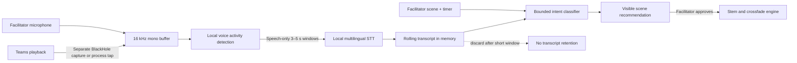

# Local Speech-to-Text Feasibility for Adaptive Music

- **Research date:** 2026-07-19
- **Status:** Synthetic smoke benchmark passed; explicit-language prototype
  implemented under ADR-0009; representative-audio validation pending
- **Question:** Can MoodX transcribe a Teams conversation locally and quickly
  enough to drive adaptive background music?
- **Observed development hardware:** MacBook Pro, Apple M4 Max, 14 CPU cores,
  36 GB unified memory
- **Scope:** macOS 14+, Japanese and English meetings, local-only processing

## Conclusion

Yes. A standalone whisper.cpp `small` smoke test is technically fast enough on
the observed M4 Max. Warm synthetic English and Japanese trials completed at a
median real-time factor of 0.062 or less, including a fresh CLI process and
model load. Adaptive music should change over several seconds or tens of
seconds, so it does not require caption-grade subsecond finalization.

This is not a production result. MoodX 0.3 now integrates the measured runtime
as an optional explicit-language prototype, but the test used clear macOS synthetic voices,
not Teams audio, and did not exercise concurrent mixer load, streaming-window
finalization, multiple speakers, compression, overlap, accents, or enterprise
vocabulary.

Local STT does not solve audio acquisition. The current MoodX graph only sees
the facilitator microphone. To understand the whole meeting, MoodX still needs
a separate, consented input containing Teams playback—through a second
BlackHole route or a Teams-only Core Audio process tap. The same BlackHole 2ch
device currently used as the Teams microphone must not also carry Teams
playback, because remote audio would be mixed back toward the meeting and could
create echo or feedback.

## Measured standalone spike

The reproducible harness at
[`../../scripts/benchmark_local_stt.py`](../../scripts/benchmark_local_stt.py)
generated fixed English and Japanese meeting phrases with macOS `say`, converted
them to mono 16 kHz PCM with FFmpeg, and invoked whisper.cpp v1.9.1 with the
multilingual `small` model, eight threads, Metal, and Silero VAD 6.2.0. Each
sample was run three times. Timings are wall-clock measurements of a fresh CLI
process and therefore include model loading.

| Sample | Audio | Median wall time | Median RTF | Text error |
|---|---:|---:|---:|---:|
| English, language fixed to `en` | 6.785 s | 0.419 s | 0.062 | WER 0.0% |
| Japanese, language fixed to `ja` | 7.934 s | 0.443 s | 0.056 | CER 2.4% |
| English then Japanese, automatic language | 14.719 s | 0.610 s | 0.041 | CER 74.3% |

The first-ever English invocation took 7.942 seconds while the Metal pipeline
compiled and cached. Subsequent fresh-process trials were below 0.62 seconds.
A separate warm Japanese process reached approximately 727 MiB maximum resident
memory and 833 MiB peak memory footprint according to macOS `/usr/bin/time -l`.
Both are below the provisional 1.5 GB memory gate.

The bilingual failure matters more than the aggregate speed. Automatic language
detection selected Japanese for the combined window and rendered the English
phrase phonetically in Japanese rather than preserving its English meaning.
MoodX must not assume that one auto-detected language covers a code-switched
window. A representative benchmark should compare a meeting-level language
setting, shorter language-homogeneous windows, and a code-switch-capable model
before an engine is selected.

These results establish compute headroom and expose a language risk; they do not
establish accuracy, latency, privacy, or product value in real meetings.

## Candidate engines

### 1. whisper.cpp — recommended spike

[whisper.cpp](https://github.com/ggml-org/whisper.cpp) is a local C/C++ runtime
for multilingual Whisper models. Its official repository documents Apple
Silicon optimization through Accelerate, Metal, and Core ML; integer
quantization; voice-activity detection; a C API; and a real-time streaming
example that samples microphone audio every 500 milliseconds.

The project documents these approximate resource requirements:

| Model | Disk | Memory | MoodX use |
|---|---:|---:|---|
| Multilingual `base` | 142 MiB | ~388 MB | Fast baseline; accuracy risk in noisy bilingual meetings |
| Multilingual `small` | 466 MiB | ~852 MB | Recommended first balance of speed, footprint, and accuracy |
| Multilingual `medium` | 1.5 GiB | ~2.1 GB | Accuracy comparison if `small` misses meeting language |
| `large-v3-turbo` | Larger model; exact MoodX package size `TBD` | `TBD` | Benchmark only if smaller models fail the intent task |

The upstream M4 Max Metal benchmark includes `tiny` through
`large-v3-turbo` and shows substantial compute headroom. Those component
timings are not an end-to-end MoodX latency measurement. Core ML can run the
encoder on the Apple Neural Engine; the project reports more than a threefold
encoder speedup over CPU-only execution in its documented setup, with a slower
first run while the model compiles for the device.

Tradeoffs:

- fully offline and predictable across supported languages;
- model and runtime can be shipped with the application;
- adds a third-party native dependency and a large model asset;
- changes the current no-third-party-dependency requirement;
- requires model-license, runtime-license, signing, update, memory, thermal,
  and security review; and
- transcription accuracy must be tested on Japanese, English, code-switching,
  accents, Teams compression, and overlapping speech.

### 2. Apple Speech framework — lower-integration alternative

Apple's
[`SFSpeechAudioBufferRecognitionRequest`](https://developer.apple.com/documentation/speech/sfspeechaudiobufferrecognitionrequest)
accepts live PCM buffers. `SFSpeechRecognizer.supportsOnDeviceRecognition`
indicates whether a recognizer can operate without network access, and a
request can require on-device recognition.

This is attractive because it is system-native, but on-device availability is
recognizer and locale dependent. MoodX would need to test Japanese and English
support on every supported macOS version and fail closed rather than silently
using a network service. It also gives the product less control over model
versioning and reproducibility. It is a valid benchmark comparator, not the
preferred fully predictable baseline.

## Recommended pipeline

The transcript should not drive arbitrary generated music directly. MoodX
should map only a small set of explicit, explainable meeting intents, for
example:

- “let's brainstorm” → offer **Brainstorm**;
- “take a minute to think” → offer **Quiet Think**;
- “we have decided” → offer **Decision Lock**;
- “let's move on” → offer a short **Transition**; and
- uncertain or conflicting evidence → make no recommendation.

Mood, sentiment, employee performance, personality, deception, and emotion are
not permitted labels. The facilitator approves changes, and speech activity
ducks the music regardless of the semantic result.

## Benchmark gate

Before accepting an STT architecture, run the same recorded, consented test set
through multilingual `base`, `small`, and one higher-accuracy candidate. Include
clean microphone audio, Teams-compressed remote audio, Japanese, English,
code-switching, overlapping speech, names, and enterprise terminology.

Proposed initial gates, subject to revision after representative measurement:

- real-time factor at or below `0.5` for sustained input;
- p95 partial-result latency within `2 seconds` after a speech window closes;
- no audio-engine underruns while the mixer, meter, and STT run together;
- steady-state additional memory below `1.5 GB` for the selected configuration;
- no network activity during recognition;
- transcript and derived feature buffers demonstrably discarded;
- explicit facilitator-visible sensing state and immediate stop; and
- intent precision favored over recall: when uncertain, MoodX stays silent.

The synthetic fixed-language samples passed the compute gate. Word error rate
and intent-accuracy thresholds remain `TBD` until a representative
Japanese/English test set and product owner are defined. Intent accuracy matters
more than perfect verbatim transcription for this feature.

## Recommendation

Advance the standalone spike to consented, representative meeting recordings
with multilingual `small`, Metal, VAD, and 3–5 second windows. Compare it with
Apple's forced-on-device recognizer where both target locales report support.
Do not connect the result to automatic playback during the spike.

If local STT is fast but semantic recommendations do not outperform manual
scenes, retain manual scenes and remove STT. If it succeeds, a new ADR must
define the capture path, dependency, model, consent, ephemeral retention,
failure behavior, and verification requirements before product integration.

## Sources

- [whisper.cpp repository and documentation](https://github.com/ggml-org/whisper.cpp)
- [whisper.cpp upstream benchmark collection](https://raw.githubusercontent.com/ggml-org/whisper.cpp/master/scripts/bench-all-gg.txt)
- [Apple: live speech-recognition audio buffers](https://developer.apple.com/documentation/speech/sfspeechaudiobufferrecognitionrequest)
- [Apple: on-device recognition support](https://developer.apple.com/documentation/speech/sfspeechrecognizer/supportsondevicerecognition)
- [Apple: Core Audio process taps](https://developer.apple.com/documentation/coreaudio/capturing-system-audio-with-core-audio-taps)
- [BlackHole official routing documentation](https://github.com/ExistentialAudio/BlackHole)
