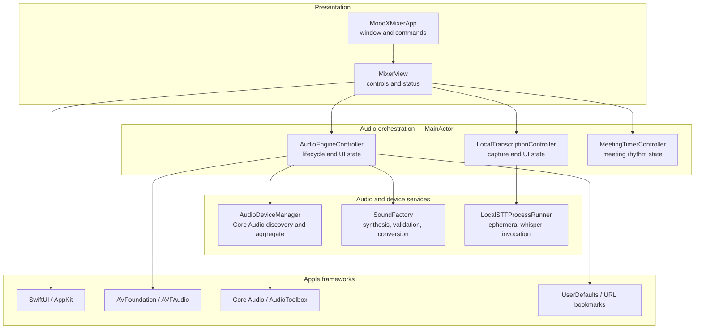
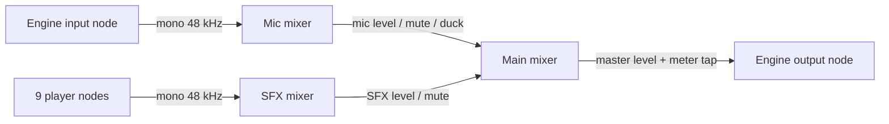
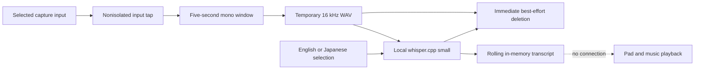
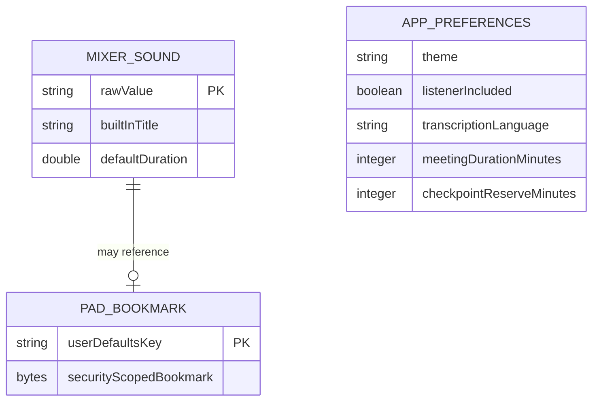
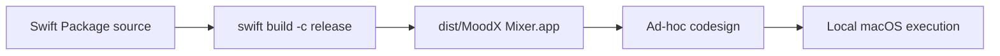

# MoodX Architecture

- **Last reviewed:** 2026-07-19
- **Architectural baseline:** ADR-0006, ADR-0007, ADR-0009, ADR-0010, and ADR-0011
- **Style:** Single-process, event-driven native desktop application

## Architectural drivers

1. The facilitator needs one centralized local performance interface.
2. Speech and effects must appear to Teams as one microphone signal.
3. Meeting audio must not be retained, uploaded, or remotely processed by MoodX.
4. The prototype should minimize dependencies, isolate its local STT runtime,
   and target macOS only.
5. Pad playback must be immediate and must not reconfigure the graph during a
   live meeting.
6. Physical devices have independent clocks and require a controlled aggregate
   route when combined with BlackHole.

## Logical components

## Component responsibilities

| Component | Responsibilities | Must not own |
|---|---|---|
| `MoodXMixerApp` | Application entry, window constraints, unified session menu command, persisted theme, shared controller lifetime | Audio graph construction |
| `MixerView` | Render state, coordinate mixer-first session startup and optional listener inclusion, expose shortcuts and file actions | Low-level device or audio framework calls |
| `AudioEngineController` | Published state, permissions, graph lifecycle, pad scheduling, ducking, levels, persistence orchestration, error presentation | Low-level device property parsing or waveform synthesis algorithms |
| `AudioDeviceManager` | Enumerate devices, read names/UIDs/channels, create/destroy private aggregate, attach it to the output unit, map first input | UI state and pad behavior |
| `SoundFactory` | Define canonical format, synthesize defaults, validate/decode/convert custom files | File selection UI and persistence |
| `MixerSound` | Stable pad identity, title, subtitle, symbol, and default duration | Runtime player or buffer state |
| `LocalTranscriptionController` | Explicit language, safe capture-device selection, second-engine lifecycle, transcript state, visible errors | Mixer output routing or semantic decisions |
| `LocalSTTChunker` | Copy real-time samples, downmix, form five-second windows, resample to mono 16 kHz WAV | UI state or model execution |
| `LocalSTTProcessRunner` | Serialize local whisper processes and delete ephemeral audio/text files | Network access, persistence, or playback control |
| `MeetingTimerController` | Meeting countdown, protected boundary, decision-checkpoint state, and Quiet Think countdown | Audio capture, meeting-content inference, participant identity, or durable meeting records |

## Audio graph

Each pad has one `AVAudioPlayerNode`. Triggering a pad stops that pad's current
playback, schedules its current buffer with `.interrupts`, and starts it. Pads
may overlap each other because they use distinct players. **Stop all** stops
every player.

## Device strategy

The engine uses one private aggregate containing:

- the selected physical microphone as a drift-compensated subdevice; and
- BlackHole as the master clock and output subdevice.

The output audio unit is assigned to this aggregate. MoodX maps input channel
zero into the mono graph. The aggregate has a unique UID and is destroyed when
the engine stops. This removes the need for manual Audio MIDI Setup while
acknowledging the current one-channel limitation.

Local transcription uses a separate AVAudioEngine and selected input device. It
does not connect that input to an output. The picker excludes the BlackHole
device used by the mixer, preventing MoodX from presenting its own virtual
microphone as a meeting-capture source. A physical input yields
facilitator-only transcription; remote Teams speech requires a distinct
loopback device configured outside the app. For an input-only device, MoodX
creates a second private aggregate with a non-BlackHole physical output solely
as the Core Audio clock; no capture samples are connected to that output.

## Local transcription pipeline

The model runs in a serialized subprocess so a slow window cannot create
parallel model loads. Stop terminates the active process, disables queued work,
and discards buffered samples. The implementation favors isolation and
prototype speed over caption-grade partial results.

## Concurrency and real-time behavior

`AudioEngineController` is isolated to `MainActor` because its state feeds
SwiftUI. AVAudioEngine invokes the meter tap on a real-time Core Audio queue.
The tap therefore comes from a `nonisolated` static factory, calculates RMS on
the audio queue, and crosses to `MainActor` only to publish the meter value.

This separation is mandatory. Creating an actor-isolated tap closure caused the
0.1.0 startup crash when Swift 6 detected execution on the wrong queue.

Pad ducking uses a generation counter and a cancellable-by-obsolescence async
delay. Only the latest pad completion may restore microphone levels, preventing
an older cue from undoing a newer cue's ducking state.

`MeetingTimerController` is also isolated to `MainActor`. A one-second SwiftUI
publisher supplies ticks; deterministic state transitions remain in the
controller and are unit tested without wall-clock waits. The controller has no
dependency on either audio engine. `MixerView` may request the existing Think
Time pad only in response to explicit facilitator start and only while the
mixer is live.

## Persistence model

There is no application database. Pad bookmarks use the key format
`moodx.pad.<sound.rawValue>.bookmark`. The filename shown in the UI is derived
from the resolved URL and is not stored separately. Audio samples are decoded
into memory and are never persisted by MoodX. UserDefaults also retains the
Light/Dark theme, Include listener choice, explicit transcription language,
meeting duration, and checkpoint reserve; it does not store transcript content
or active meeting-timer state.

## Error and fallback strategy

| Failure | Behavior |
|---|---|
| BlackHole absent | Show an error; do not start the graph |
| No physical input | Show a missing-device error; do not start |
| Microphone permission undecided | Request access, then retry start if granted |
| Microphone permission denied | Show an error; do not start |
| Aggregate or audio-unit operation fails | Tear down partial engine state, destroy aggregate if created, show routing error |
| Custom file empty, over 30 seconds, unreadable, or unconvertible | Keep current pad buffer and show validation error |
| Saved bookmark invalid at launch | Remove bookmark, use built-in pad, show restoration error |
| User changes input while live | Stop and restart the private patch |

## Security and privacy architecture

- The app requests only microphone access required by its core function.
- Local file access uses the standard open panel and security-scoped bookmarks.
- MoodX does not copy selected files into an application library.
- Transcription windows are temporary local files deleted after recognition;
  transcript text remains capped in memory until cleared or process exit.
- No network client, analytics SDK, authentication system, server, or cloud
  storage exists in the native target.
- The app does not record the graph output.
- Audio sent into Teams leaves the MoodX boundary and becomes subject to Teams
  and enterprise meeting policies.

See [`DATA_FLOW.md`](DATA_FLOW.md) for the detailed live-audio, custom-file,
bookmark-restoration, state, retention, and error flows.

## Build and deployment

The prototype is a Swift Package executable assembled into an app bundle by
`scripts/build_macos_app.sh`. It is ad-hoc signed. Developer ID signing,
notarization, installer packaging, managed enterprise deployment, automatic
updates, and release channels are not implemented.

## Quality attributes and trade-offs

| Attribute | Current approach | Trade-off or risk |
|---|---|---|
| Privacy | Fully local processing, no retained recordings, capped in-memory transcript | Temporary STT files need crash-recovery cleanup verification |
| Responsiveness | Predecoded in-memory pad buffers | Maximum 30-second custom sounds and memory proportional to assigned audio |
| Simplicity | Native app plus isolated local whisper subprocess; no server | macOS-only, BlackHole-dependent, and a large bundled model |
| Operability | Automatic private aggregate | Core Audio device changes and driver installation remain support risks |
| Safety | Stop All, mute controls, headphones warning | No enforced cooldown or loudness normalization yet |
| Maintainability | Small native components and isolated whisper subprocess | Third-party runtime/model packaging, licensing, and upgrades require explicit maintenance |
| Participation safety | Manual checkpoint and explicit Quiet Think start; no meeting inference | Usefulness and cultural fit remain unvalidated in real meetings |
| Distribution | Local build and ad-hoc signature | Not suitable for broad enterprise rollout yet |

## Future architectural decision points

A new ADR is required before adding a managed sample library, trimming or
waveform editing, effects monitoring to a second device, MIDI/global hotkeys,
telemetry, recording, durable meeting/timer state, cloud synchronization, a Teams application or bot,
notarized distribution, Windows support, or automatic facilitation inference.
