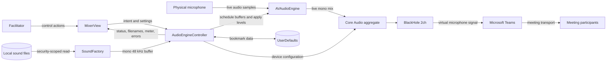
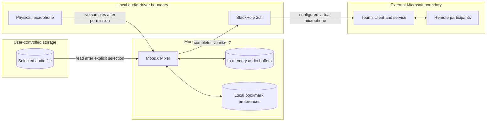
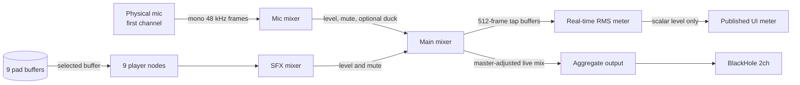
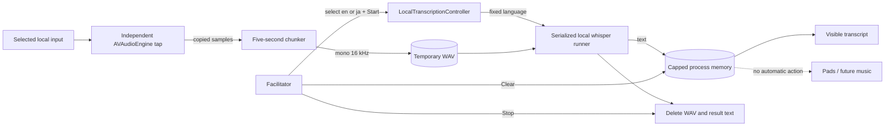
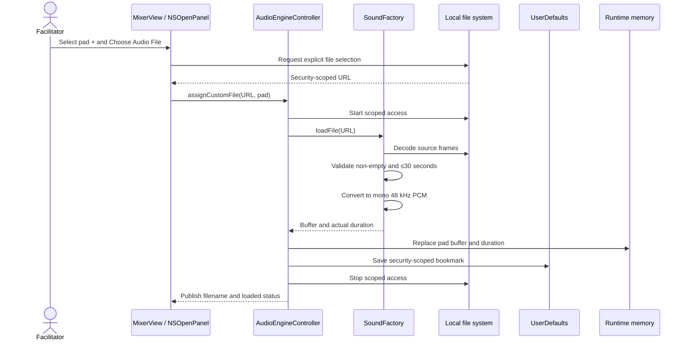
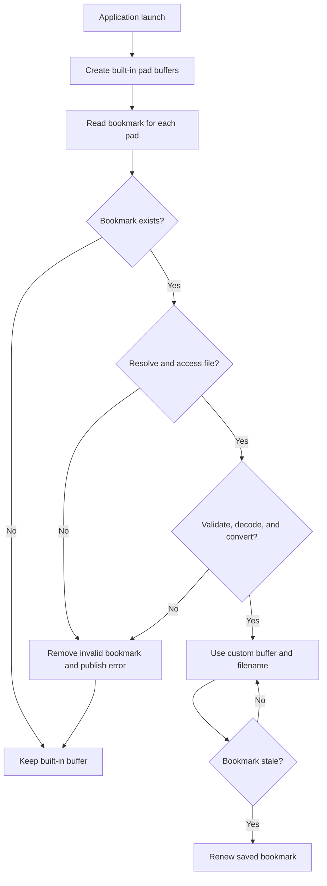
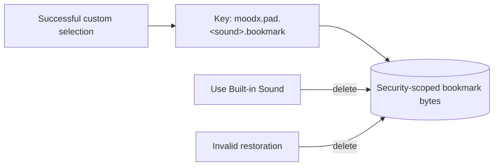
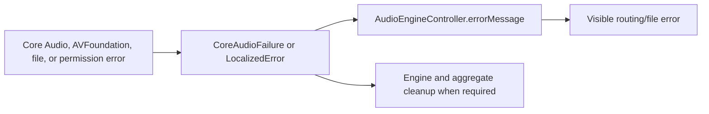

# MoodX Data Flow

- **Last reviewed:** 2026-07-19
- **Scope:** Native macOS mixer 0.4.0
- **Related decisions:** ADR-0006, ADR-0007, ADR-0009, ADR-0010, and ADR-0011

## Purpose

This document describes how audio, device metadata, user configuration, file
references, runtime state, and errors move through MoodX. It distinguishes
ephemeral audio from persistent configuration and identifies the point where
the mixed signal leaves the MoodX trust boundary for Microsoft Teams. It also
documents optional local transcription and its temporary-file lifecycle.

## Data-flow summary

## Data classification

| Data class | Examples | Sensitivity | Storage | Leaves MoodX? |
|---|---|---|---|---|
| Live microphone audio | Facilitator speech and ambient input | Potentially confidential meeting content | No MoodX persistence | Yes, through BlackHole when Teams uses it as the microphone |
| Pad audio | Built-in synthesis or selected local effect | User-provided content; licensing may apply | Decoded in memory only | Yes, as part of the mixed Teams signal |
| Mixed audio | Microphone plus pad output | Potentially confidential meeting content | No MoodX persistence | Yes, to BlackHole and then Teams |
| File bookmark | Security-scoped reference to a selected file | Local path/access metadata | UserDefaults until reset or invalidation | No |
| Device metadata | Device ID, UID, name, channel counts | Local system configuration | Runtime memory only | No |
| Mixer state | Levels, mute state, ducking, selected input | Low sensitivity | Runtime memory only in the current version | No |
| UI status | Running state, meter, filename, current cue, error | May reveal local filenames/device names | Runtime UI state only | No |
| Generated default sounds | Synthesized waveform buffers | Non-personal application content | Runtime memory only | Only when played into the mix |
| STT capture audio | Five-second windows from the selected input | Potentially confidential meeting content | Temporary local WAV until recognition completes or is cancelled | No |
| Transcript text | English or Japanese recognized speech | Confidential derived meeting content | Capped process memory until Clear or process exit | No |
| Language selection | `en` or `ja` | Low sensitivity | UserDefaults across launches | No |
| UI preferences | Light/Dark theme and Include listener | Low sensitivity | UserDefaults across launches | No |
| Meeting timing preferences | Meeting minutes and protected final minutes | Low sensitivity | UserDefaults across launches | No |
| Meeting rhythm state | Remaining seconds, timer/checkpoint state, Quiet Think countdown | Low sensitivity; no meeting content | Process memory until reset or exit | No |

MoodX does not intentionally collect participant identity, attendance,
reactions, biometrics, engagement scores, or meeting metadata. It displays an
optional local transcript but does not persist or transmit it.

The meeting-rhythm controller receives only facilitator settings/actions and a
one-second local tick. It does not consume microphone audio, transcript text,
Teams data, or participant behavior. An explicit Quiet Think start can request
the existing local Think Time pad when the mixer is live; timer boundaries
alone never play audio.

## DFD Level 0 — trust boundaries

The only intended external data egress is the live mixed audio that the
facilitator explicitly routes from BlackHole into Teams. Security-scoped file
references and device metadata remain local.

## DFD Level 1 — live audio processing

## DFD Level 1 — optional local transcription

The capture input is independent of the mixer input and may be the physical
microphone. Full-room audio requires a distinct loopback; the BlackHole device
used as MoodX's virtual output is filtered out. The runner is local and has no
network path.

### Live-audio transformations

1. Core Audio supplies the first selected microphone input channel.
2. The microphone path applies microphone level, mute, and optional ducking.
3. Each pad player receives its current predecoded mono 48 kHz buffer.
4. The SFX path applies the shared effects level and mute.
5. The main mixer combines both paths and applies master level or mute.
6. A 512-frame tap calculates RMS. Only the scalar meter level crosses to the
   main actor; tap audio is not retained.
7. The output unit sends the live mix through the private aggregate to
   BlackHole.

## DFD Level 1 — custom-file assignment

The file is read but not copied. MoodX stores the bookmark only after decoding
and conversion succeed, so an invalid selection does not replace the working
pad or its saved reference.

## DFD Level 1 — launch restoration

## Control and state flow

| Source action | Controller state change | Audio effect |
|---|---|---|
| Select microphone while stopped | Update `selectedInputID` | None until start |
| Select microphone while live | Update ID, stop engine, rebuild route | Brief routing interruption |
| Start session | Start the mixer, then start local transcription when Include listener is enabled and its runtime/input are available | Begin microphone-to-BlackHole mix and optional five-second STT capture |
| Change level or mute | Update published property and node volume | Immediate channel/master gain change |
| Enable ducking | Update `duckMic` | Next played cue may reduce mic level |
| Trigger pad | Update `nowPlaying`, generation counter | Stop/restart that pad player and optionally duck mic |
| Stop All | Increment generation and stop every player | End all SFX and restore configured levels |
| Stop session | Stop transcription, clear players/engine, and reset meter/status | End optional STT capture, end BlackHole output, and destroy aggregates |
| Reset pad | Remove buffer reference and bookmark | Restore generated default |
| Start/pause/resume/reset meeting timer | Advance or replace in-memory meeting-clock state | None |
| Reach protected boundary or invoke it early | Pause meeting clock and present decision prompt | None |
| Start Quiet Think explicitly | Run meeting and 45-second clocks together | Play Think Time pad only when the mixer is live |
| Continue without Quiet Think | Mark checkpoint skipped and resume meeting clock | None |

## Persistence and retention

| Item | Retention | Deletion trigger |
|---|---|---|
| Live microphone and mix frames | Audio callback lifetime only | Frames leave the graph naturally |
| Built-in and custom decoded buffers | Current process lifetime | App termination or pad replacement |
| Security-scoped pad bookmark | Across launches | Built-in reset, invalid restoration, preference removal, or app data deletion |
| Meter scalar | Latest published UI value | Replaced by next update; set to zero on stop |
| Errors and status | Current UI state | Replaced by subsequent state |
| Native STT sample buffer | Up to one five-second window | Discarded after WAV creation or Stop |
| Temporary STT WAV and result text | One serialized recognition job | Deleted after result, failure, or cancellation; crash recovery pending |
| Rolling transcript | Up to 8,000 characters in process memory | Clear control or process exit |
| Selected language | Across launches | Preference removal or app data deletion |
| Meeting duration and checkpoint reserve | Across launches | Preference removal or app data deletion |
| Active meeting timer/checkpoint state | Current process lifetime | Reset or process exit |

MoodX does not control any separate Teams recording or transcription. The local
transcript described here is independent of Teams and remains within MoodX.

## Error data flow

Errors are presented locally. MoodX has no remote logging, crash-upload,
analytics, or telemetry path. macOS may create local diagnostic reports when a
process crashes; those reports are owned by the operating system and are not
transmitted by MoodX.

## Data-flow invariants

- Mixer audio shall not enter a recording or network sink owned by MoodX.
- STT audio may enter only an ephemeral local file sink and local whisper
  process; it shall not be retained or transmitted.
- The meter tap shall publish only a scalar level, not an audio buffer.
- A local audio file shall not be copied as part of pad assignment.
- An invalid custom file shall not replace the current valid pad buffer.
- Only the complete mixed output shall be routed to BlackHole.
- The BlackHole device carrying MoodX output shall not be selectable as the STT
  capture input. A separate loopback is required for remote Teams playback.
- Bookmark bytes shall remain in local preferences and shall not leave the Mac.
- Participant identity or engagement data shall not enter the system.

## Validation gaps

- Packet-level or process-level confirmation of zero unintended network egress
  has not been recorded; source inspection shows no network client.
- Long-session memory behavior with nine maximum-duration custom files is
  unmeasured.
- File restoration after moves, permission changes, external-drive removal, and
  protected-media selection needs a negative test matrix.
- Teams-side recording, transcription, and enterprise retention behavior is
  outside MoodX and must be evaluated separately for each deployment.
- Crash-interrupted temporary-file cleanup and a no-network runtime trace remain
  pending.
