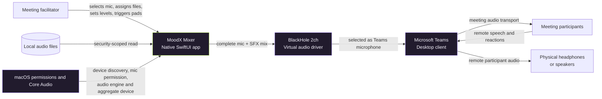
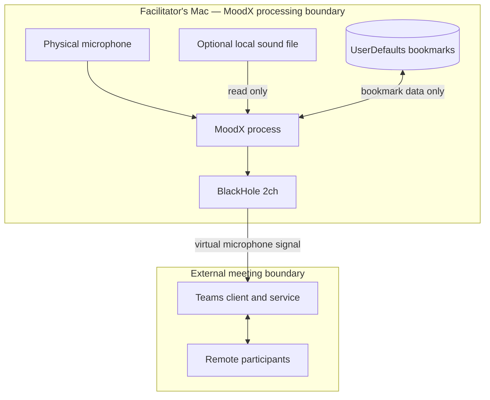

# MoodX System Context

- **Last reviewed:** 2026-07-19
- **Scope:** Native macOS prototype only
- **Related decisions:** ADR-0006, ADR-0007, ADR-0009, ADR-0010, and ADR-0011

## Purpose

MoodX gives a meeting facilitator one local interface for combining a physical
microphone with triggered sound effects and presenting that mix to Microsoft
Teams as a virtual microphone. Its current purpose is to test whether deliberate
facilitation cues can improve meeting flow and contribution breadth without
retaining recordings, uploading speech, or scoring participants. Optional local
transcription currently supports facilitator-selected English or Japanese.

## Context diagram

## People and roles

| Role | Responsibility | Current interaction |
|---|---|---|
| Facilitator | Operates MoodX and chooses culturally appropriate, licensed cues | Direct native UI and keyboard shortcuts |
| Meeting organizer | Establishes participant expectations and consent | Process outside the app; exact workflow `TBD` |
| Participant | Hears the mixed facilitator audio through Teams | No direct MoodX client or stored profile |
| Local developer | Builds and ad-hoc signs the prototype | Swift Package and `scripts/build_macos_app.sh` |
| Enterprise administrator | May govern BlackHole installation, Teams configuration, and app distribution | Deployment process `TBD` |

## External systems and dependencies

| Dependency | Why it is required | Ownership | Failure effect |
|---|---|---|---|
| macOS 14+ | SwiftUI, AVFoundation, AVAudioEngine, and Core Audio runtime | Apple | App cannot run on unsupported platforms |
| Microphone permission | Grants access to the selected physical input | User/macOS | Mixer cannot start |
| Physical microphone | Supplies facilitator speech | User/device vendor | Mixer cannot create the intended input route |
| BlackHole 2ch | Exposes the MoodX output as a virtual microphone | Existential Audio/local admin | Teams cannot receive the MoodX mix |
| Microsoft Teams | Carries the mixed audio into the meeting | Microsoft/enterprise admin | End-to-end meeting use is unavailable |
| Local audio files | Optional custom pad sources | User | Affected pad falls back to its built-in sound when restoration fails |
| Swift/Xcode toolchain | Builds the local prototype bundle | Apple/developer | No local build; not required at runtime after packaging |
| whisper.cpp + multilingual `small` model | Optional offline transcription | ggml-org/OpenAI model artifact, locally bundled | Mixer remains available; transcription cannot start |

## Trust and privacy boundaries

MoodX does not retain recordings or transcripts and does not implement cloud
audio processing, emotion inference, participant identity profiles, or
engagement scores. Optional transcript windows and text remain local and
ephemeral. Teams processes the outgoing signal under the enterprise's Microsoft
configuration and policies; that processing is outside MoodX's boundary.

## Data exchanged

| Flow | Content | Persistence in MoodX |
|---|---|---|
| Microphone → MoodX | Live audio samples | None |
| Local file → MoodX | Decoded audio, maximum 30 seconds per pad | In-memory buffer while the app runs |
| MoodX → BlackHole | Live mono 48 kHz mixed audio | None |
| MoodX → UserDefaults | Security-scoped bookmark per customized pad | Local until reset or invalidated |
| MoodX → UI | Device names, levels, status, filenames, and errors | UI state only, except bookmarks |
| Selected capture input → local STT | Five-second speech windows | Temporary local WAV deleted after processing |
| Local STT → UI | English or Japanese transcript | Capped process memory until clear or exit |

## Context exclusions

- Windows, iOS, Android, and browser production runtimes.
- A Teams extension, meeting bot, or cloud service.
- Automatic meeting-state detection or autonomous cue selection.
- Participant-level clients, profiles, controls, or analytics.
- Signed and notarized distribution to other facilitators.
