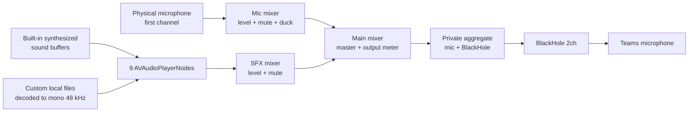
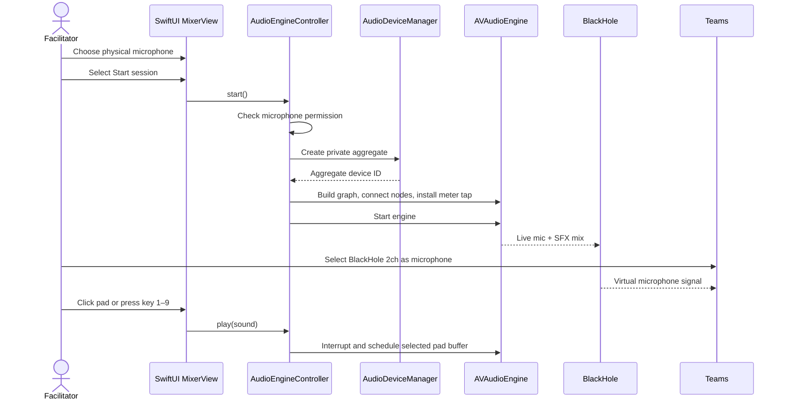
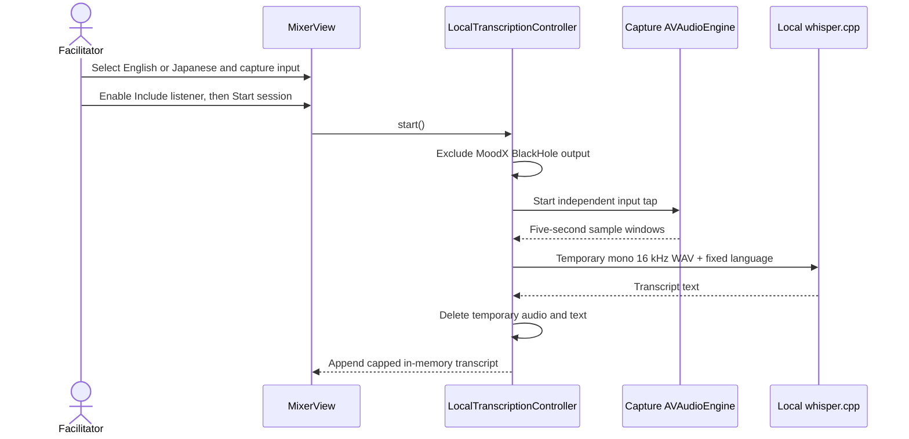
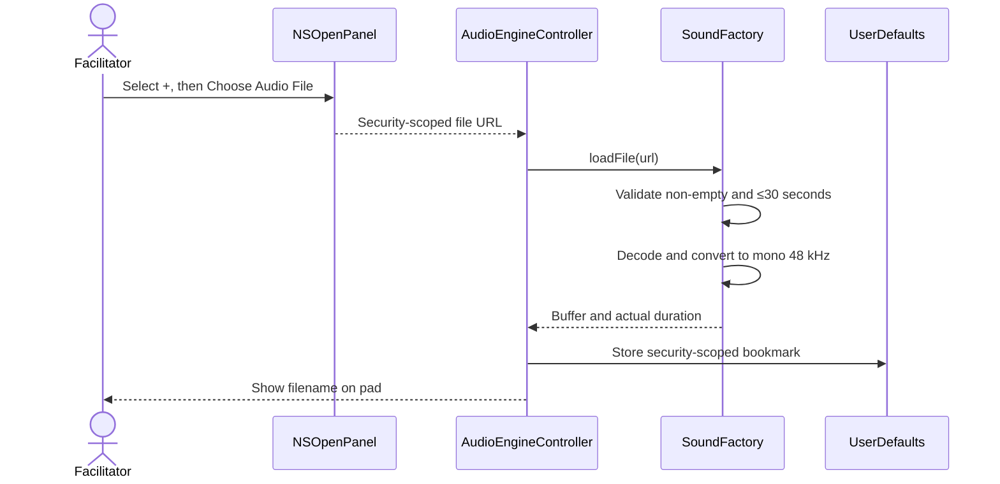

# MoodX System Overview

- **Last reviewed:** 2026-07-19
- **Implementation:** `macos/MoodXMixer/`
- **Runtime:** Native SwiftUI executable on macOS 14+

## System summary

MoodX is a single-process desktop application. It discovers local Core Audio
devices, identifies a physical input and BlackHole output, creates a private
aggregate audio device, and runs one AVAudioEngine graph. The graph mixes the
first physical microphone channel with up to nine pad players and sends the
result through BlackHole. Microsoft Teams consumes BlackHole as its microphone.

The app has no server, database, account, network API, telemetry pipeline, or
meeting integration. It can optionally capture a separate local input and run
five-second windows through a bundled local whisper.cpp runtime using an
explicit English or Japanese selection. Custom pad bookmarks and the selected
language, meeting length, and protected-checkpoint duration are the only durable
application data beyond pad bookmarks. Transcript content and active timer
state are not persisted.

## End-to-end signal path



All audio entering the graph uses a one-channel, 48,000 Hz standard PCM format.
Built-in sounds are synthesized at launch. A custom file is decoded and
converted when assigned or restored, then retained as an in-memory buffer for
low-latency playback.

## Primary operating flow



## Optional local transcription flow



## Custom pad flow



The original audio file is not copied. If bookmark restoration fails on a later
launch, MoodX removes the invalid reference, reports the failure, and retains
the built-in sound for that pad.

## Meeting rhythm flow

```mermaid
sequenceDiagram
    actor F as Facilitator
    participant UI as MixerView
    participant M as MeetingTimerController
    participant A as AudioEngineController

    F->>UI: Choose meeting length and protected final minutes
    F->>UI: Start timer
    UI->>M: start()
    M->>M: Count down to protected boundary
    M-->>UI: Pause and suggest decision checkpoint
    F->>UI: Start Quiet Think (or continue without it)
    UI->>M: startQuietThink()
    opt Audio session is live
        UI->>A: play(Think Time)
    end
    M->>M: Count meeting and Quiet Think together for 45 seconds
    M-->>UI: Checkpoint completed; meeting continues
```

The facilitator can invoke the checkpoint before the reserved boundary. MoodX
does not derive the suggestion from audio, transcript, silence, or participant
behavior.

## Runtime lifecycle

| Phase | Behavior |
|---|---|
| Application initialization | Discover devices, choose the first eligible input, detect BlackHole, synthesize defaults, restore valid pad bookmarks |
| Ready | Permit device choice and pad customization; audio graph is absent |
| Start requested | Validate dependencies and permission, create aggregate, assemble graph, install meter tap, start engine |
| Live | Route speech and triggered pads; apply level, mute, ducking, and meter updates |
| Meeting timing | Run an independent in-memory countdown; protect the configured final interval and offer facilitator-controlled Quiet Think |
| Stop requested | Stop pad players, remove meter tap, stop/reset engine, destroy private aggregate |
| Process exit | Core Audio removes the private process-scoped aggregate; explicit stop remains the normal cleanup path |

## User-facing controls

- physical microphone picker;
- unified Start session / Stop session lifecycle for the mixer and optional
  listener;
- nine sound pads and number keys `1`–`9`;
- per-pad **+** menu for local-file selection and built-in reset;
- microphone, SFX, and master level and mute controls;
- optional microphone ducking during a cue;
- live mixed-output meter;
- **Stop all** or Escape panic control; and
- Command-R start/stop session menu shortcut;
- explicit English/Japanese transcription language;
- independent transcription-input picker and persisted Include listener option;
- capped, selectable in-memory transcript with Clear; and
- persisted Light/Dark theme toggle and Command-Shift-L shortcut; and
- configurable meeting timer, protected decision checkpoint, and 45-second
  Quiet Think suggestion.

## Current verification boundary

Verified locally: compilation, automated audio-file conversion, release bundle,
ad-hoc signing, device discovery, engine startup, live meter, BlackHole route at
the application level, pad playback, custom-file picker, persistence, reset,
meeting-timer state transitions, packaged checkpoint/Quiet Think interaction,
and absence of new crash reports during the recorded regressions.

Pending: remote receipt in a Teams test call, echo and clipping checks,
perceived loudness, latency acceptability, accessibility validation, cultural
fit, and the product's effect on meeting participation.
